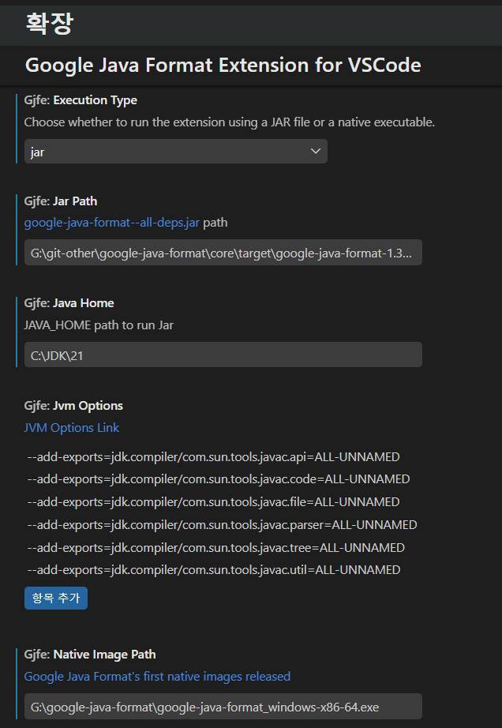

# Google Java Format for VSCode

VSCode에서 [google-java-format](https://github.com/google/google-java-format)을 Java 포매터로 사용할 수 있게 해주는 확장입니다.

## 기능

- Java 파일을 google-java-format 규칙으로 포맷합니다.
- Native 실행 파일과 JAR 실행 방식을 모두 지원합니다.
- 설정 화면에서 실행 방식과 실행 파일 경로를 지정할 수 있습니다.

### 설정 화면



## 요구사항

- VSCode 1.120.0 이상
- google-java-format 실행 파일
  - Native 방식: OS에 맞는 native image 실행 파일
  - JAR 방식: `google-java-format-<version>-all-deps.jar`
- JAR 방식 사용 시 Java 실행 환경

google-java-format 파일은 [google-java-format Releases](https://github.com/google/google-java-format/releases)에서 받을 수 있습니다.

## 확장 설정

### 실행 방식

- `gjfe.executionType`: google-java-format 실행 방식을 선택합니다.

선택 가능한 값은 다음과 같습니다.

- `native`: native image 실행 파일을 사용합니다.
- `jar`: JAR 파일을 Java로 실행합니다.

google-java-format 1.20.0부터 native image가 제공됩니다. 일반적으로 JAR 방식보다 실행 속도가 빠르므로, 사용할 수 있는 환경이라면 `native` 방식을 권장합니다.<br>

### Native 실행 방식

- `gjfe.nativeImagePath`: native image 실행 파일의 전체 경로입니다.

예:

```text
C:\google-java-format\google-java-format_windows-x86-64.exe
```


### JAR 실행 방식

- `gjfe.jarPath`: google-java-format JAR 파일의 전체 경로입니다.
- `gjfe.javaHome`: JAR 파일을 실행할 때 사용할 `JAVA_HOME` 경로입니다.
- `gjfe.jvmOptions`: JAR 파일 실행 시 추가할 JVM 옵션 목록입니다.

##### 설정값 예시:

`gjfe.jarPath`

* ```C:\git-other\google-java-format\core\target\google-java-format-1.35.0-all-deps.jar```

`gjfe.javaHome`

* `C:\JDK\21`

Java 17 이상에서 google-java-format을 JAR 방식으로 실행할 때 JDK 내부 API 접근이 제한될 수 있습니다. 이 확장은 다음 `--add-exports` 옵션을 기본값으로 제공합니다.

```text
--add-exports=jdk.compiler/com.sun.tools.javac.api=ALL-UNNAMED
--add-exports=jdk.compiler/com.sun.tools.javac.code=ALL-UNNAMED
--add-exports=jdk.compiler/com.sun.tools.javac.file=ALL-UNNAMED
--add-exports=jdk.compiler/com.sun.tools.javac.parser=ALL-UNNAMED
--add-exports=jdk.compiler/com.sun.tools.javac.tree=ALL-UNNAMED
--add-exports=jdk.compiler/com.sun.tools.javac.util=ALL-UNNAMED
```

이 확장은 등호 없이 입력한 값도 실행 가능한 형태로 처리하지만, `--add-exports` 옵션은 등호(`=`)를 사용하는 형식을 권장합니다. <br>

## 알려진 이슈

- 현재 등록된 알려진 이슈가 없습니다.<br>

## 릴리스 노트

### 0.0.1

- 최초 릴리스
- Native 실행 방식 지원
- JAR 실행 방식 지원
